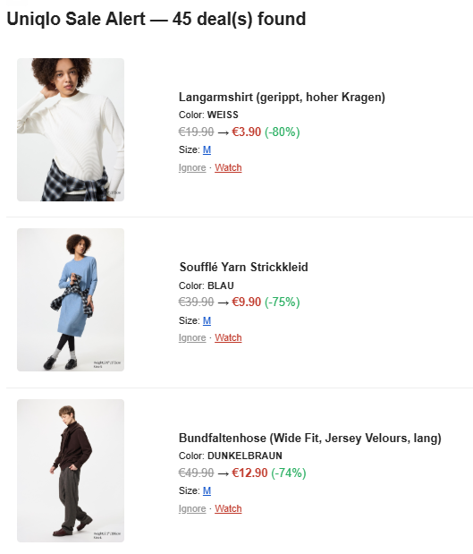

# Uniqlo Sales Alerter

A self-hosted server that monitors [Uniqlo](https://www.uniqlo.com) sales and sends you notifications when items match your criteria. Talks directly to Uniqlo's internal Commerce API — no browser automation or scraping required.



## Table of Contents

- [Quick Start](#quick-start)
- [Configuration](#configuration)
- [Deployment](#deployment)
- [Preview Modes](#preview-modes)
- [Notifications](#notifications)
- [How It Works](#how-it-works)
- [Development](#development)

## Features

- **Periodic sale monitoring** — polls the Uniqlo catalogue on a configurable interval
- **Configurable filters** — gender, minimum discount %, clothing/pants/shoe sizes (verified against real-time stock), watched product URLs
- **Preview modes** — CLI (terminal) or HTML (visual report with product images)
- **Notifications** — Telegram (with images), Email (HTML), extensible to Discord/Slack/etc.

## Quick Start

The fastest way to get running is with Docker. You need two files in a folder:

**config.yaml** — copy the [example config](config.yaml) and set your country + filters:

```yaml
uniqlo:
  country: "de/de"              # see supported countries below
  check_interval_minutes: 30

filters:
  gender: [men, women]
  min_sale_percentage: 30
  sizes:
    clothing: [S, M, L]
```

**.env** — your notification secrets (only include what you use):

```env
SMTP_USER=you@gmail.com
SMTP_PASSWORD=your-app-password
TELEGRAM_BOT_TOKEN=123456:ABC...
TELEGRAM_CHAT_ID=987654321
```

### Docker Compose

```yaml
services:
  uniqlo-alerter:
    image: kequach/uniqlo-sales-alerter:latest
    container_name: uniqlo-alerter
    restart: unless-stopped
    ports:
      - "8000:8000"
    volumes:
      - ./config.yaml:/app/config.yaml:ro
      - alerter-state:/app/data
    env_file:
      - .env
    environment:
      - STATE_FILE=/app/data/.seen_variants.json

volumes:
  alerter-state:
```

```bash
docker compose up -d
```

Open <http://localhost:8000/docs> for the interactive API docs.

### Docker run

```bash
docker run -d \
  --name uniqlo-alerter \
  -p 8000:8000 \
  -v ./config.yaml:/app/config.yaml:ro \
  -v alerter-state:/app/data \
  -e STATE_FILE=/app/data/.seen_variants.json \
  --env-file .env \
  --restart unless-stopped \
  kequach/uniqlo-sales-alerter
```

| Flag | Purpose |
|---|---|
| `-d` | Run in the background (detached) |
| `-p 8000:8000` | Expose the REST API and docs at `http://localhost:8000/docs` |
| `-v ./config.yaml:…:ro` | Mount your config file (read-only) |
| `-v alerter-state:…` | Named volume so the state file survives restarts |
| `--env-file .env` | Load notification secrets from `.env` |
| `--restart unless-stopped` | Auto-restart on failure or reboot |

### Without Docker

Requires [Python 3.11+](https://www.python.org/downloads/).

```bash
git clone https://github.com/kequach/uniqlo-sales-alerter.git
cd uniqlo-sales-alerter
python -m pip install -e .
python -m uniqlo_sales_alerter
```

## Configuration

All configuration lives in `config.yaml`. Secrets are passed as environment variables and referenced with `${VAR_NAME}` syntax so they stay out of version control.

### Supported countries

```yaml
uniqlo:
  country: "de/de"
```

| Country | Value | | Country | Value |
|---------|-------|-|---------|-------|
| Germany | `de/de` | | Australia | `au/en` |
| UK | `uk/en` | | India | `in/en` |
| France | `fr/fr` | | Indonesia | `id/en` |
| Spain | `es/es` | | Vietnam | `vn/vi` |
| Italy | `it/it` | | Philippines | `ph/en` |
| Belgium (FR) | `be/fr` | | Malaysia | `my/en` |
| Belgium (NL) | `be/nl` | | Thailand | `th/en` |
| Netherlands | `nl/nl` | | | |
| Denmark | `dk/en` | | | |
| Sweden | `se/en` | | | |

> **Not supported:** US, Canada, Japan, South Korea, and Singapore. These stores show a "Sale" label on their website, but behind the scenes they don't provide an original price to compare against — only the current (already reduced) price. Without knowing what the item cost before, the alerter has no way to calculate a discount. This is a limitation of how Uniqlo's system works in those regions, not something that can be fixed on our end.

### Filters

```yaml
filters:
  gender:
    - men          # options: men, women, unisex, kids, baby
    - women

  min_sale_percentage: 50   # only show items at least 50% off

  sizes:
    clothing:      # XXS, XS, S, M, L, XL, XXL, 3XL
      - S
      - M
      - L
    pants:         # 22inch – 40inch
      - "32inch"
    shoes:         # 37 – 43, half sizes supported
      - "42"
      - "42.5"
    one_size: false  # set to true to include bags, hats, accessories
```

Only sizes that are actually **in stock** will be shown. You can leave any size category empty or remove it entirely.

<details>
<summary><strong>Size filter reference</strong></summary>

| Category | Config key | Valid values |
|----------|-----------|-------------|
| Clothing | `clothing` | `XXS`, `XS`, `S`, `M`, `L`, `XL`, `XXL`, `3XL` |
| Pants | `pants` | `22inch` – `40inch` (women's jeans start at 22, men's at 28) |
| Shoes | `shoes` | `37`, `37.5`, `38`, `38.5`, `39`, `40`, `41`, `41.5`, `42`, `42.5`, `43` |
| One Size | `one_size` | Boolean — matches bags, hats, accessories labelled "One Size" |

A product passes if it has **at least one** in-stock size matching any configured value. If all categories are empty, every product passes.

</details>

### Watched products

Track a specific product regardless of whether it's on sale:

```yaml
filters:
  watched_urls:
    - "https://www.uniqlo.com/de/de/products/E483045-000/00?colorDisplayCode=70&sizeDisplayCode=003"
```

You'll be notified whenever the item is in stock, even without a discount.

### Email notifications (Gmail)

1. Go to [myaccount.google.com](https://myaccount.google.com) → **Security** → enable **2-Step Verification**.
2. Go to [App Passwords](https://myaccount.google.com/apppasswords), create one for "Mail", and copy the 16-character password.
3. Add to `config.yaml`:

```yaml
notifications:
  channels:
    email:
      enabled: true
      smtp_host: "smtp.gmail.com"
      smtp_port: 587
      use_tls: true
      smtp_user: "${SMTP_USER}"
      smtp_password: "${SMTP_PASSWORD}"
      from_address: "you@gmail.com"
      to_addresses:
        - "you@gmail.com"
```

4. Set the environment variables `SMTP_USER` and `SMTP_PASSWORD` (via `.env`, `export`, or your deployment method).

<details>
<summary><strong>Other email providers</strong></summary>

| Provider | `smtp_host` | `smtp_port` | Notes |
|----------|-------------|-------------|-------|
| Gmail | `smtp.gmail.com` | `587` | Requires [App Password](https://support.google.com/accounts/answer/185833). Enable 2FA first. |
| Outlook / Microsoft 365 | `smtp.office365.com` | `587` | Use your full email as `smtp_user`. |
| Yahoo | `smtp.mail.yahoo.com` | `587` | Requires [App Password](https://help.yahoo.com/kb/generate-manage-third-party-passwords-sln15241.html). |
| Custom / self-hosted | Your server | `587` or `465` | Set `use_tls: true` for STARTTLS (587) or implicit TLS (465). |

</details>

### Telegram notifications

1. Message [@BotFather](https://t.me/BotFather) on Telegram, send `/newbot`, and copy the **bot token**.
2. Send any message to your new bot, then open `https://api.telegram.org/bot<YOUR_TOKEN>/getUpdates` to find your **chat ID**.
3. Add to `config.yaml`:

```yaml
notifications:
  channels:
    telegram:
      enabled: true
      bot_token: "${TELEGRAM_BOT_TOKEN}"
      chat_id: "${TELEGRAM_CHAT_ID}"
```

4. Set the environment variables `TELEGRAM_BOT_TOKEN` and `TELEGRAM_CHAT_ID`.

### Notification modes

The `notify_on` setting controls which deals trigger a notification:

| Mode | Config value | Behaviour |
|------|-------------|-----------|
| **All then new** *(default)* | `all_then_new` | All deals on first check after startup, then only changes. |
| **New deals only** | `new_deals` | Only changes, even across restarts (state persists). |
| **Every check** | `every_check` | All matching deals on every check. Good for digests. |

```yaml
notifications:
  notify_on: all_then_new
```

<details>
<summary><strong>What counts as a "change"?</strong></summary>

| Change | Triggers notification? |
|--------|:----------------------:|
| New product appears on sale | Yes |
| New size becomes available | Yes |
| New colour becomes available | Yes |
| Discount percentage changes | Yes |
| Product goes back on sale | Yes |
| No change (same sizes, colours, price) | No |

The system tracks every `product:color:size:discount%` combination in `.seen_variants.json`. A deal is "new" if it has at least one previously unseen combination. In `all_then_new` mode the state resets on restart; in `new_deals` mode it persists. Delete `.seen_variants.json` to reset tracking.

</details>

## Deployment

### Docker (recommended)

See [Quick Start](#quick-start) for getting up and running. Additional Docker operations:

```bash
docker compose logs -f              # live log output
docker compose restart              # restart after config changes
docker compose down                 # stop and remove container
```

**Update to latest version:**

```bash
docker compose pull
docker compose up -d
```

**One-off preview** (runs a single check and exits):

```bash
docker run --rm \
  -v ./config.yaml:/app/config.yaml:ro \
  --env-file .env \
  kequach/uniqlo-sales-alerter:latest \
  python -m uniqlo_sales_alerter --preview-cli
```

> The state file (`.seen_variants.json`) is stored in the `alerter-state` named volume so it survives container restarts and updates.

The image is available on [Docker Hub](https://hub.docker.com/r/kequach/uniqlo-sales-alerter).

### Linux (Raspberry Pi / VPS)

Run as a systemd service for automatic startup, restart on failure, and background operation.

**1. Install:**

```bash
cd /opt
sudo git clone https://github.com/kequach/uniqlo-sales-alerter.git
sudo chown -R $(whoami):$(whoami) uniqlo-sales-alerter
cd uniqlo-sales-alerter

python3 -m venv .venv
source .venv/bin/activate
pip install -e .
```

**2. Configure:**

```bash
nano config.yaml
```

Create a secrets file:

```bash
sudo nano /etc/uniqlo-sales-alerter.env
```

```ini
SMTP_USER=you@gmail.com
SMTP_PASSWORD=abcdefghijklmnop
TELEGRAM_BOT_TOKEN=123456:ABC-DEF1234ghIkl-zyx57W2v1u123ew11
TELEGRAM_CHAT_ID=987654321
```

```bash
sudo chmod 600 /etc/uniqlo-sales-alerter.env
```

**3. Create the service:**

```bash
sudo nano /etc/systemd/system/uniqlo-alerter.service
```

```ini
[Unit]
Description=Uniqlo Sales Alerter
After=network-online.target
Wants=network-online.target

[Service]
Type=simple
User=pi
WorkingDirectory=/opt/uniqlo-sales-alerter
EnvironmentFile=/etc/uniqlo-sales-alerter.env
ExecStart=/opt/uniqlo-sales-alerter/.venv/bin/python -m uniqlo_sales_alerter
Restart=on-failure
RestartSec=30
NoNewPrivileges=true
ProtectSystem=strict
ReadWritePaths=/opt/uniqlo-sales-alerter
PrivateTmp=true

[Install]
WantedBy=multi-user.target
```

> Change `User=pi` to your username. On a VPS this might be `ubuntu`, `deploy`, etc.

**4. Start:**

```bash
sudo systemctl daemon-reload
sudo systemctl enable --now uniqlo-alerter
```

**5. Manage:**

```bash
sudo systemctl status uniqlo-alerter   # check status
sudo journalctl -u uniqlo-alerter -f   # live logs
sudo systemctl restart uniqlo-alerter  # restart
```

**6. Update:**

```bash
cd /opt/uniqlo-sales-alerter
source .venv/bin/activate
git pull
pip install -e .
sudo systemctl restart uniqlo-alerter
```

**Quick test** (before enabling the service):

```bash
cd /opt/uniqlo-sales-alerter
source .venv/bin/activate
export $(cat /etc/uniqlo-sales-alerter.env | xargs)
python -m uniqlo_sales_alerter --preview-cli
```

### Manual (any platform)

Requires [Python 3.11+](https://www.python.org/downloads/).

**Install:**

```bash
git clone https://github.com/kequach/uniqlo-sales-alerter.git
cd uniqlo-sales-alerter
python -m pip install -e .
```

Or [download the ZIP](https://github.com/kequach/uniqlo-sales-alerter/archive/refs/heads/main.zip), extract, and run `python -m pip install -e .` in the folder.

> On Linux/macOS you may need `python3` instead of `python`.

**Set environment variables:**

```bash
# Linux / macOS
export SMTP_USER="you@gmail.com"
export SMTP_PASSWORD="abcd efgh ijkl mnop"
```

```powershell
# Windows (PowerShell)
$env:SMTP_USER     = "you@gmail.com"
$env:SMTP_PASSWORD = "abcd efgh ijkl mnop"
```

**Test and run:**

```bash
python -m uniqlo_sales_alerter --preview-cli   # one-off check
python -m uniqlo_sales_alerter                  # start server
```

The server runs on `http://localhost:8000` with interactive API docs at `/docs`.

## Preview Modes

Preview modes let you see matching deals locally without waiting for the next scheduled check.

| Mode | CLI flag | What it does |
|------|----------|--------------|
| **CLI** | `--preview-cli` | Prints deals to the terminal (colour-coded) |
| **HTML** | `--preview-html` | Generates an HTML report with product images and opens it in your browser |

```bash
python -m uniqlo_sales_alerter --preview-cli
python -m uniqlo_sales_alerter --preview-html
python -m uniqlo_sales_alerter --preview-html --config path/to/config.yaml
```

Previews can also run alongside the server by setting `preview_cli: true` or `preview_html: true` under `notifications` in `config.yaml`.

### CLI example

```
============================================================
  Uniqlo Sale Alert — 3 deal(s)
============================================================

  1. AIRism Baumwolle T-Shirt (oversized, Rundhals)
     €19.90 -> €3.90  (-80%)
        XS  https://www.uniqlo.com/de/de/products/E465185-000/00?colorDisplayCode=64&sizeDisplayCode=002
         S  https://www.uniqlo.com/de/de/products/E465185-000/00?colorDisplayCode=64&sizeDisplayCode=003

  2. Ultra Light Down Jacke [WATCHED]
     €79.90 -> €29.90  (-63%)
         M  https://www.uniqlo.com/de/de/products/E482873-000/00?colorDisplayCode=09&sizeDisplayCode=004
         L  https://www.uniqlo.com/de/de/products/E482873-000/00?colorDisplayCode=09&sizeDisplayCode=005

  3. Souffle Yarn Pullover
     €39.90 -> €19.90  (-50%)
         M  https://www.uniqlo.com/de/de/products/E476543-000/00?colorDisplayCode=01&sizeDisplayCode=004

  Scanned 284 sale items, 3 matched your filters.
```

### HTML example


The report includes product images, strikethrough prices with discount badges, and clickable size chips linking to in-stock variants. Dark mode is supported. Reports are saved to `reports/`.

## Notifications

### Telegram

Each deal is sent as a photo message with the product image and a caption showing the price drop, discount percentage, available sizes, and a link to the product page.

### Email

Deals are sent as a single HTML email with product images, prices, discount badges, and direct links per size.

### Adding a custom channel

The notification system uses Python's `Protocol` for structural subtyping:

```python
from uniqlo_sales_alerter.models.products import SaleItem

class DiscordNotifier:
    def __init__(self, config):
        self._config = config

    def is_enabled(self) -> bool:
        return self._config.enabled

    async def send(self, deals: list[SaleItem]) -> None:
        ...
```

Register it in `notifications/dispatcher.py` or at runtime via `dispatcher.register(notifier)`.

## How It Works

The server reverse-engineers Uniqlo's internal Commerce API (the same one their website uses). On each check it:

1. Queries four API sources in parallel — `flagCodes=discount` and `flagCodes=limitedOffer` across both v5 and v3 API versions — and merges/deduplicates the results. Different regions use different versions and flags; this ensures full coverage.
2. Verifies each item has a promo price lower than the base price.
3. Computes the discount percentage and applies your filters (gender, sizes, min discount %).
4. **Verifies real-time stock** — fetches the stock endpoint per product to check which colour×size combinations are purchasable. Out-of-stock sizes are excluded.
5. Generates **direct variant URLs** pointing to an in-stock colour for each size. The colour with the highest stock quantity is preferred.
6. Caches results for fast API responses.
7. Compares variants against a persistent state file (`.seen_variants.json`) to flag new or changed deals.
8. Sends notifications via enabled channels.

## Development

```bash
pip install -e ".[dev]"              # install with dev dependencies
python -m pytest tests/ -v           # run tests
python -m ruff check src/ tests/     # lint
```

### Project structure

```
src/uniqlo_sales_alerter/
├── __main__.py              # CLI entry-point
├── main.py                  # FastAPI app, scheduler
├── config.py                # YAML + env var config loading
├── api/routes.py            # REST endpoints
├── clients/uniqlo.py        # Uniqlo Commerce API client
├── models/products.py       # Pydantic models
├── services/sale_checker.py # Filtering, caching, state tracking
└── notifications/
    ├── base.py              # Notifier protocol
    ├── console.py           # CLI preview
    ├── html_report.py       # HTML preview
    ├── telegram.py          # Telegram channel
    ├── email.py             # Email channel
    └── dispatcher.py        # Multi-channel dispatcher
```

## License

[MIT](LICENSE)
