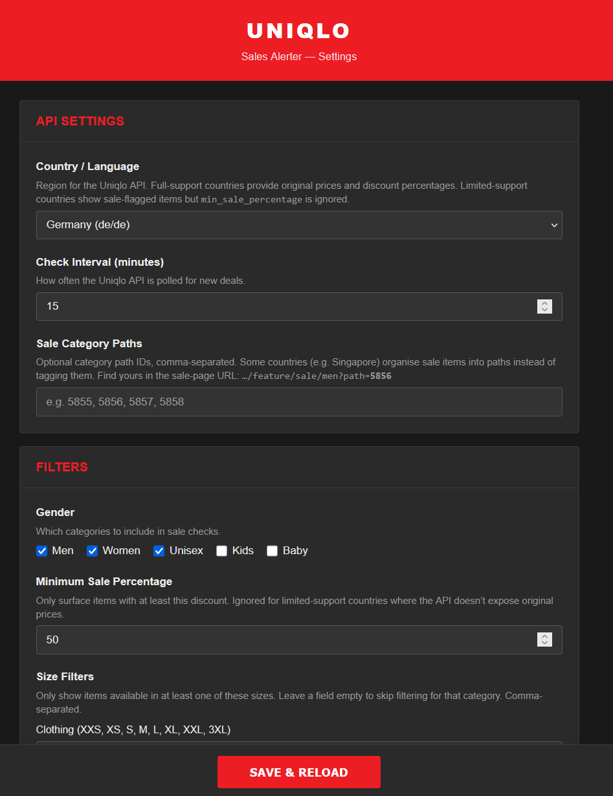
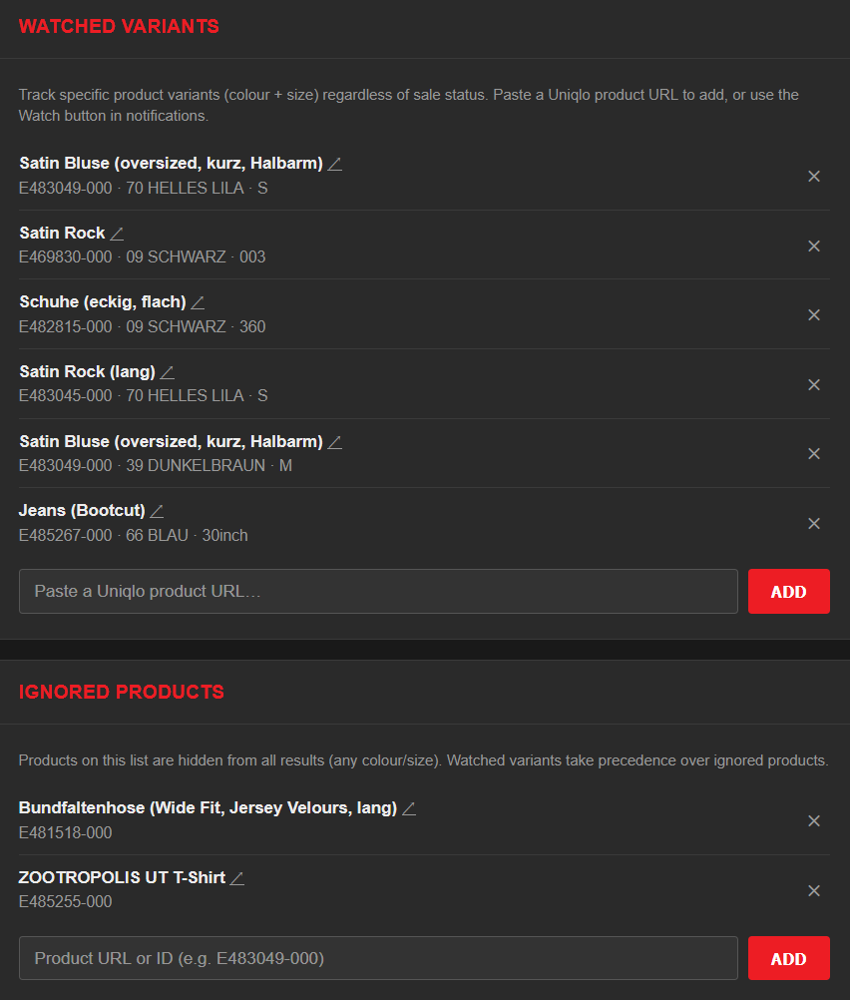

# Uniqlo Sales Alerter

[](LICENSE)
[](https://www.python.org/downloads/)
[](https://hub.docker.com/r/kequach/uniqlo-sales-alerter)

A self-hosted server that monitors [Uniqlo](https://www.uniqlo.com) sales and sends you notifications when items match your criteria. It talks directly to Uniqlo's internal Commerce API.


## Table of Contents

- [Quick Start](#quick-start)
- [Configuration](#configuration)
- [Notifications](#notifications)
- [Deployment](#deployment)
- [Preview Modes](#preview-modes)
- [REST API](#rest-api)
- [Development](#development)

## Quick Start

Start with Docker, no config needed. Set everything up in the browser:

```bash
docker run -d --name uniqlo-alerter -p 8000:8000 kequach/uniqlo-sales-alerter
```

Open **http://localhost:8000/settings** to configure your country, filters, sizes, and notification channels. Click **Save & Reload** to apply. The app ships with reasonable defaults (Germany, 50% min discount, no notifications enabled).



The settings page covers everything: country, scheduling, quiet hours, filters, watched variants, ignored products, and notification channels. Changes are saved to `config.yaml` and applied immediately without a restart. For long-term use, mount a config file so settings survive container recreation.

### Docker with config file

Copy the [example config](config.yaml) and adjust to your needs:

```yaml
uniqlo:
  country: "de/de"                       # see supported countries below
  check_interval_minutes: 30

filters:
  gender: [men, women]
  min_sale_percentage: 30
  sizes:
    clothing: [S, M, L]

notifications:
  channels:
    email:
      enabled: true
      smtp_user: "you@gmail.com"
      smtp_password: "your-app-password"
      from_address: "you@gmail.com"
      to_addresses: ["you@gmail.com"]
```

See [`config.yaml`](config.yaml) for all available options.

Start with Docker Compose (using the shipped [`docker-compose.yml`](docker-compose.yml)):

```bash
docker compose up -d
```

Or with `docker run`:

```bash
docker run -d \
  --name uniqlo-alerter \
  -p 8000:8000 \
  -v ./config.yaml:/app/config.yaml \
  -v alerter-state:/app/data \
  -e STATE_FILE=/app/data/.seen_variants.json \
  --restart unless-stopped \
  kequach/uniqlo-sales-alerter
```

> You can edit the config at any time via the web UI at `http://localhost:8000/settings`.

<details>
<summary><strong>Docker with env vars only</strong></summary>

Skip the config file and pass everything as `-e` flags. Env vars are persisted to `config.yaml` on first startup. Only values differing from defaults need to be set:

```bash
docker run -d \
  --name uniqlo-alerter \
  -p 8000:8000 \
  -v alerter-state:/app/data \
  -e STATE_FILE=/app/data/.seen_variants.json \
  -e UNIQLO_COUNTRY=de/de \
  -e UNIQLO_CHECK_INTERVAL=30 \
  -e FILTER_GENDER=men,women \
  -e FILTER_MIN_SALE_PERCENTAGE=30 \
  -e FILTER_SIZES_CLOTHING=S,M,L \
  -e EMAIL_ENABLED=true \
  -e SMTP_USER=you@gmail.com \
  -e SMTP_PASSWORD=your-app-password \
  -e SMTP_FROM=you@gmail.com \
  -e SMTP_TO=you@gmail.com \
  --restart unless-stopped \
  kequach/uniqlo-sales-alerter
```

See the full [env var reference](#environment-variables).

</details>

<details>
<summary><strong>Without Docker</strong></summary>

Requires [Python 3.11+](https://www.python.org/downloads/). On Linux/macOS you may need `python3` instead of `python`.

```bash
git clone https://github.com/kequach/uniqlo-sales-alerter.git
cd uniqlo-sales-alerter
python -m pip install -e .
python -m uniqlo_sales_alerter              # start the server
python -m uniqlo_sales_alerter --preview-html  # or preview deals in browser
```

Or [download the ZIP](https://github.com/kequach/uniqlo-sales-alerter/archive/refs/heads/main.zip), extract it, and run `pip install -e .` in the folder. The server runs on `http://localhost:8000`. The web UI lives at `/settings`, API docs at `/docs`.

</details>

## Configuration

You can configure things through the web UI, `config.yaml`, or [environment variables](#environment-variables). On startup, env vars get merged into `config.yaml` so all settings end up in one place. The [example config](config.yaml) has comments explaining every option.

<details>
<summary><strong>Supported countries</strong></summary>

**Full support** (discount percentage, original vs. sale price, all filters):

| Country | Value | | Country | Value |
|---------|-------|-|---------|-------|
| Germany | `de/de` | | Australia | `au/en` |
| UK | `uk/en` | | India | `in/en` |
| France | `fr/fr` | | Indonesia | `id/en` |
| Spain | `es/es` | | Vietnam | `vn/vi` |
| Italy | `it/it` | | Philippines | `ph/en` |
| Belgium (FR) | `be/fr` | | Malaysia | `my/en` |
| Belgium (NL) | `be/nl` | | Thailand | `th/en` |
| Netherlands | `nl/nl` | | | |
| Denmark | `dk/en` | | | |
| Sweden | `se/en` | | | |

**Limited support** (sale-flagged items only, no discount percentage):

| Country | Value |
|---------|-------|
| United States | `us/en` |
| Canada | `ca/en` |
| Japan | `jp/ja` |
| South Korea | `kr/ko` |
| Singapore | `sg/en` |

Limited countries show a "Sale" label instead of a discount percentage. The `min_sale_percentage` filter is automatically skipped; gender and size filters still work.

**Singapore** requires `sale_paths`, see [sale category paths](#sale-category-paths).

</details>

### Filters

Filter by gender (`men`, `women`, `unisex`, `kids`, `baby`), minimum discount percentage, and sizes. Only in-stock sizes are shown. See [`config.yaml`](config.yaml) for all options.

<details>
<summary><strong>Size filter reference</strong></summary>

| Category | Config key | Valid values |
|----------|-----------|-------------|
| Clothing | `clothing` | `XXS`, `XS`, `S`, `M`, `L`, `XL`, `XXL`, `3XL` |
| Pants | `pants` | `22inch` – `40inch` |
| Shoes | `shoes` | `37` – `43` (half sizes supported) |
| One Size | `one_size` | Boolean (bags, hats, accessories) |

A product matches if it has at least one in-stock size that matches any of your configured values.

</details>

### Watched variants and ignored products



**Watched variants** let you monitor specific items (colour + size) even when they're not on sale. Paste a Uniqlo product URL in the web UI or add it to `config.yaml`. You'll be notified when a watched variant comes in stock, gets a new size, goes on sale, or has its discount change. Watched items appear with a **WATCHED** badge and bypass all filters.

```yaml
filters:
  watched_variants:
    - url: "https://www.uniqlo.com/de/de/products/E483045-000/00?colorDisplayCode=70&sizeDisplayCode=003"
```

**Ignored products** are hidden from all results. Add by product ID or URL. Watched variants take precedence, so a watched variant still shows up even if its product is ignored.

```yaml
filters:
  ignored_products:
    - id: "E483049-000"
```

Product names and metadata are pulled from the API on startup.

### Scheduling

```yaml
uniqlo:
  check_interval_minutes: 60            # periodic, respects quiet hours (0 to disable)
  scheduled_checks: ["12:00", "18:00"]  # fixed daily times, ignores quiet hours

quiet_hours:
  enabled: true
  start: "01:00"                        # 24h format, may cross midnight
  end: "08:00"
```

Both modes can be used together. If a scheduled check ran recently, the next periodic check is skipped.

### Server URL

Set `server_url` to get **Ignore**, **Watch/Unwatch** action buttons and a **Settings** link in your notifications. The `port` is appended automatically. Leave it empty to hide the buttons.

```yaml
server_url: "http://192.168.1.50"
port: 8000
```

<details>
<summary><strong>Sale category paths (Singapore)</strong></summary>

Singapore organises sale items into category paths. Without `sale_paths` configured, the alerter will miss most items. You can find path IDs in the sale page URL (`...?path=5856`):

```yaml
uniqlo:
  country: "sg/en"
  sale_paths: ["5855", "5856", "5857", "5858"]
```

Known paths: `5855` (all), `5856` (men), `5857` (women), `5858` (kids).

</details>

<details>
<summary><strong>Environment variables</strong></summary>

Every config option can be set via env vars for initial setup. On first startup they get merged into `config.yaml`; after that the YAML file is the source of truth.

| Env variable | Type | Config equivalent |
|---|---|---|
| `UNIQLO_COUNTRY` | string | `uniqlo.country` |
| `UNIQLO_CHECK_INTERVAL` | int | `uniqlo.check_interval_minutes` |
| `SCHEDULED_CHECKS` | comma-separated | `uniqlo.scheduled_checks` |
| `UNIQLO_SALE_PATHS` | comma-separated | `uniqlo.sale_paths` |
| `QUIET_HOURS_ENABLED` | true/false | `quiet_hours.enabled` |
| `QUIET_HOURS_START` | string (HH:MM) | `quiet_hours.start` |
| `QUIET_HOURS_END` | string (HH:MM) | `quiet_hours.end` |
| `FILTER_GENDER` | comma-separated | `filters.gender` |
| `FILTER_MIN_SALE_PERCENTAGE` | float | `filters.min_sale_percentage` |
| `FILTER_SIZES_CLOTHING` | comma-separated | `filters.sizes.clothing` |
| `FILTER_SIZES_PANTS` | comma-separated | `filters.sizes.pants` |
| `FILTER_SIZES_SHOES` | comma-separated | `filters.sizes.shoes` |
| `FILTER_SIZES_ONE_SIZE` | true/false | `filters.sizes.one_size` |
| `FILTER_WATCHED_URLS` | comma-separated | `filters.watched_urls` (auto-migrated to `watched_variants`) |
| `FILTER_IGNORED_IDS` | comma-separated | `filters.ignored_products` (IDs only, names blank) |
| `SERVER_URL` | string | `server_url` |
| `PORT` | int | `port` |
| `NOTIFY_ON` | string | `notifications.notify_on` |
| `CHECK_ON_STARTUP` | true/false | `notifications.check_on_startup` |
| `PREVIEW_CLI` | true/false | `notifications.preview_cli` |
| `PREVIEW_HTML` | true/false | `notifications.preview_html` |
| `NOTIFY_LOW_STOCK_THRESHOLD` | int | `notifications.low_stock_threshold` |
| `NOTIFY_SUPPRESS_LOW_STOCK_ALERTS` | true/false | `notifications.suppress_low_stock_alerts` |
| `TELEGRAM_ENABLED` | true/false | `notifications.channels.telegram.enabled` |
| `TELEGRAM_BOT_TOKEN` | string | `notifications.channels.telegram.bot_token` |
| `TELEGRAM_CHAT_ID` | string | `notifications.channels.telegram.chat_id` |
| `EMAIL_ENABLED` | true/false | `notifications.channels.email.enabled` |
| `SMTP_HOST` | string | `notifications.channels.email.smtp_host` |
| `SMTP_PORT` | int | `notifications.channels.email.smtp_port` |
| `SMTP_USE_TLS` | true/false | `notifications.channels.email.use_tls` |
| `SMTP_USER` | string | `notifications.channels.email.smtp_user` |
| `SMTP_PASSWORD` | string | `notifications.channels.email.smtp_password` |
| `SMTP_FROM` | string | `notifications.channels.email.from_address` |
| `SMTP_TO` | comma-separated | `notifications.channels.email.to_addresses` |

</details>

## Notifications

### Email

Sends HTML emails with product images, prices, discount badges, and direct links for each colour+size variant.

**Gmail setup:** enable [2-Step Verification](https://myaccount.google.com), create an [App Password](https://myaccount.google.com/apppasswords), then configure:

```yaml
notifications:
  channels:
    email:
      enabled: true
      smtp_host: "smtp.gmail.com"
      smtp_port: 587
      use_tls: true
      smtp_user: "you@gmail.com"
      smtp_password: "your-app-password"
      from_address: "you@gmail.com"
      to_addresses: ["you@gmail.com"]
```

<details>
<summary><strong>Other email providers</strong></summary>

| Provider | `smtp_host` | `smtp_port` | Notes |
|----------|-------------|-------------|-------|
| Gmail | `smtp.gmail.com` | `587` | Requires [App Password](https://support.google.com/accounts/answer/185833). |
| Outlook / Microsoft 365 | `smtp.office365.com` | `587` | Use full email as `smtp_user`. |
| Yahoo | `smtp.mail.yahoo.com` | `587` | Requires [App Password](https://help.yahoo.com/kb/generate-manage-third-party-passwords-sln15241.html). |
| Custom / self-hosted | Your server | `587` or `465` | `use_tls: true` for STARTTLS (587) or implicit TLS (465). |

</details>

### Telegram

Sends photo messages with the product image, colour, price, discount, sizes, and a link to the product page.

1. Message [@BotFather](https://t.me/BotFather), send `/newbot`, copy the **bot token**.
2. Send a message to your bot, then open `https://api.telegram.org/bot<TOKEN>/getUpdates` for your **chat ID**.
3. Configure:

```yaml
notifications:
  channels:
    telegram:
      enabled: true
      bot_token: "123456:ABC-DEF1234ghIkl-zyx57W2v1u123ew11"
      chat_id: "987654321"
```

### How notifications are triggered

#### Modes

| Mode | Config value | Behaviour |
|------|-------------|-----------|
| **All then new** *(default)* | `all_then_new` | Sends all deals on the first check, then only new/changed ones. |
| **New deals only** | `new_deals` | Only new/changed deals, even across restarts (state is persisted). |
| **Every check** | `every_check` | Sends all matching deals every time. Good for daily digests. |

#### Variant key

Internally each purchasable variant has a unique key:

```
product_id:color:size:discount%
```

A deal is considered "new" when at least one of its variant keys is not in the seen-set. The seen-set is refreshed after every run — anything not currently in stock is evicted, which is the mechanism that lets restocks re-notify.

Unknown-discount countries (US, CA, JP, KR, SG, PH, TH) substitute the literal `sale` for the percentage.

When `notifications.suppress_low_stock_alerts: true`, variants currently below the low-stock threshold are **omitted** from the key set. They stay unseen, so they won't fire a "new deal" alert until the quantity climbs back above the threshold. This is useful when you don't want to be pinged every time an out-of-stock item restocks with only 2 units.

#### Trigger matrix

| Event | Notification fired? |
|---|---|
| Item first seen (fresh process start or new variant appears) | Yes, unless `suppress_low_stock_alerts` is on and the variant is below the threshold |
| New size or colour becomes available on an existing deal | Yes, same caveat as above |
| Discount percentage changes (price change) | Yes |
| Item leaves the sale feed or goes fully out of stock | Silent drop (no "gone" alert; all its keys are evicted) |
| A single size goes out of stock (others remain) | Silent drop for that size |
| Variant restocks after being out of stock, above threshold | Yes — reappears as a new deal |
| Variant restocks after being out of stock, at or below threshold | Yes — unless `suppress_low_stock_alerts: true` |
| Stock quantity changes but stays above the threshold | Never |
| Variant quantity drops below threshold (no OOS) | Never — key is already in the seen-set |
| Suppressed variant climbs back above the threshold | Yes — fires as a new deal |

#### State persistence

- **`new_deals`** mode saves the seen-set to `.seen_variants.json` (path configurable via `STATE_FILE`). State survives container restarts. Delete the file to reset.
- **`all_then_new`** mode keeps the seen-set in memory only. Every process restart fires one "all current deals" notification, then behaves like `new_deals` for the rest of that session.
- **`every_check`** mode ignores the seen-set entirely — every run sends every matching deal.

#### Notification Triggers settings

The web UI's **Notification Triggers** section (between Schedule and General) exposes:

- **Suppress Low-Stock Alerts** — toggles the `suppress_low_stock_alerts` flag described above. Off by default, so upgrades don't change existing behaviour. Turn it on when you want to stop being pinged about OOS items that restock with only a handful of units; the alert will fire again once the quantity climbs above the threshold.
- **Low-Stock Threshold** — integer, default `3`. A variant is considered low stock when its remaining quantity is at or below this number. When positive this setting is **authoritative** — it overrides the Uniqlo API's own `LOW_STOCK` flag, so a variant the API calls "low" at 50 units won't be badged (or suppressed) if you only care about ≤3. Set to `0` to disable the numeric comparison and fall back to the API's flag as the sole signal.

#### Country caveat (PH / TH)

Thailand and Philippines use Uniqlo's v3 API, whose stock endpoint reports 100% out-of-stock even when items are clearly available. The checker falls back to L2 data without stock filtering for these countries — meaning OOS, restock, and low-stock transitions aren't detected, and the low-stock suppression toggle has no effect. Discount / size changes still trigger normally.

## Deployment

<details>
<summary><strong>Updating</strong></summary>

**Docker Compose:**

```bash
docker compose pull && docker compose up -d
```

**Docker run:**

```bash
docker stop uniqlo-alerter && docker rm uniqlo-alerter
docker pull kequach/uniqlo-sales-alerter
docker run -d \
  --name uniqlo-alerter \
  -p 8000:8000 \
  -v ./config.yaml:/app/config.yaml \
  -v alerter-state:/app/data \
  -e STATE_FILE=/app/data/.seen_variants.json \
  --restart unless-stopped \
  kequach/uniqlo-sales-alerter
```

**Git install:**

```bash
git pull && pip install -e .
sudo systemctl restart uniqlo-alerter   # if using systemd
```

</details>

<details>
<summary><strong>Docker tips</strong></summary>

```bash
docker compose logs -f              # live logs
docker compose down                 # stop and remove
```

**Quick preview** (runs a single check and prints results to the terminal):

```bash
docker run --rm -p 8000:8000 \
  -v ./config.yaml:/app/config.yaml:ro \
  kequach/uniqlo-sales-alerter \
  python -m uniqlo_sales_alerter --preview-cli
```

The state file (`.seen_variants.json`) is stored in the `alerter-state` named volume so it survives restarts. The image is available on [Docker Hub](https://hub.docker.com/r/kequach/uniqlo-sales-alerter) for `linux/amd64` and `linux/arm64`.

</details>

<details>
<summary><strong>Linux (systemd)</strong></summary>

**1. Install:**

```bash
cd /opt
sudo git clone https://github.com/kequach/uniqlo-sales-alerter.git
sudo chown -R $(whoami):$(whoami) uniqlo-sales-alerter
cd uniqlo-sales-alerter

python3 -m venv .venv
source .venv/bin/activate
pip install -e .
```

**2. Create the service:**

```bash
sudo nano /etc/systemd/system/uniqlo-alerter.service
```

```ini
[Unit]
Description=Uniqlo Sales Alerter
After=network-online.target
Wants=network-online.target

[Service]
Type=simple
User=pi
WorkingDirectory=/opt/uniqlo-sales-alerter
ExecStart=/opt/uniqlo-sales-alerter/.venv/bin/python -m uniqlo_sales_alerter
Restart=on-failure
RestartSec=30
NoNewPrivileges=true
ProtectSystem=strict
ReadWritePaths=/opt/uniqlo-sales-alerter
PrivateTmp=true

[Install]
WantedBy=multi-user.target
```

> Change `User=pi` to your username.

**3. Start:**

```bash
sudo systemctl daemon-reload
sudo systemctl enable --now uniqlo-alerter
```

**4. Manage:**

```bash
sudo systemctl status uniqlo-alerter   # check status
sudo journalctl -u uniqlo-alerter -f   # live logs
sudo systemctl restart uniqlo-alerter  # restart
```

</details>

## Preview Modes

Check what deals are available without sending any notifications:

```bash
python -m uniqlo_sales_alerter --preview-cli    # terminal output
python -m uniqlo_sales_alerter --preview-html   # HTML report in browser
```

You can also keep previews enabled alongside notifications in the web UI or `config.yaml`.


<details>
<summary><strong>CLI preview example</strong></summary>

```
============================================================
  Uniqlo Sale Alert — 3 deal(s)
============================================================

  1. AIRism Baumwolle T-Shirt (oversized, Rundhals)
     €19.90 -> €3.90  (-80%)
     Color: BLAU
        XS  https://www.uniqlo.com/de/de/products/E465185-000/00?colorDisplayCode=64&sizeDisplayCode=002
         S  https://www.uniqlo.com/de/de/products/E465185-000/00?colorDisplayCode=64&sizeDisplayCode=003

  2. Ultra Light Down Jacke [WATCHED]
     €79.90 -> €29.90  (-63%)
     Color: SCHWARZ
         M  https://www.uniqlo.com/de/de/products/E482873-000/00?colorDisplayCode=09&sizeDisplayCode=004
         L  https://www.uniqlo.com/de/de/products/E482873-000/00?colorDisplayCode=09&sizeDisplayCode=005

  3. Souffle Yarn Pullover
     €39.90 -> €19.90  (-50%)
     Color: WEISS
         M  https://www.uniqlo.com/de/de/products/E476543-000/00?colorDisplayCode=01&sizeDisplayCode=004
```

</details>

## REST API

Swagger UI is at `/docs`.

| Method | Endpoint | Description |
|--------|----------|-------------|
| `GET` | `/health` | Health check |
| `GET` | `/settings` | Web UI (HTML) |
| `GET` | `/api/v1/sales` | Latest results (filterable by `gender`, `min_discount`) |
| `POST` | `/api/v1/sales/check` | Trigger an immediate check |
| `GET` | `/api/v1/products/{id}` | Look up a product |
| `GET` | `/api/v1/config` | Current config (secrets redacted) |
| `PUT` | `/api/v1/config` | Update config (save & reload) |
| `GET` | `/actions/ignore/{id}` | Ignore a product |
| `GET` | `/actions/watch/{id}` | Watch a variant |
| `GET` | `/actions/unwatch/{id}` | Unwatch a product |

## Development

```bash
pip install -e ".[dev]"
python -m pytest tests/ -v
python -m ruff check src/ tests/
```

### How it works

The server uses Uniqlo's internal Commerce API (the same one their website uses). On each check it queries multiple API versions and flag codes in parallel, deduplicates the results, applies your filters, checks real-time stock for each variant, and builds direct URLs to purchasable items. A state file tracks which variants you've already seen so you only get notified about new stuff.

### Project structure

```
src/uniqlo_sales_alerter/
├── __main__.py              # CLI entry-point
├── main.py                  # FastAPI app, scheduler
├── config.py                # YAML + env var config loading
├── settings_ui.py           # Web UI settings page
├── api/routes.py            # REST endpoints
├── clients/uniqlo.py        # Uniqlo Commerce API client
├── models/products.py       # Pydantic models
├── services/sale_checker.py # Filtering, caching, state tracking
└── notifications/
    ├── base.py              # Notifier protocol
    ├── console.py           # CLI preview
    ├── html_report.py       # HTML preview
    ├── telegram.py          # Telegram channel
    ├── email.py             # Email channel
    └── dispatcher.py        # Multi-channel dispatcher
```

## License

[MIT](LICENSE)
